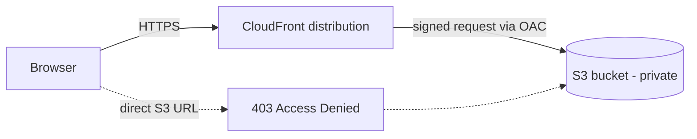
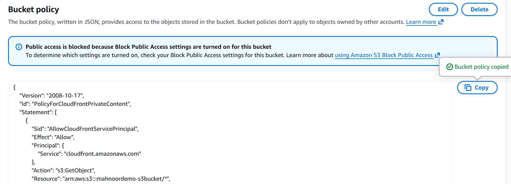
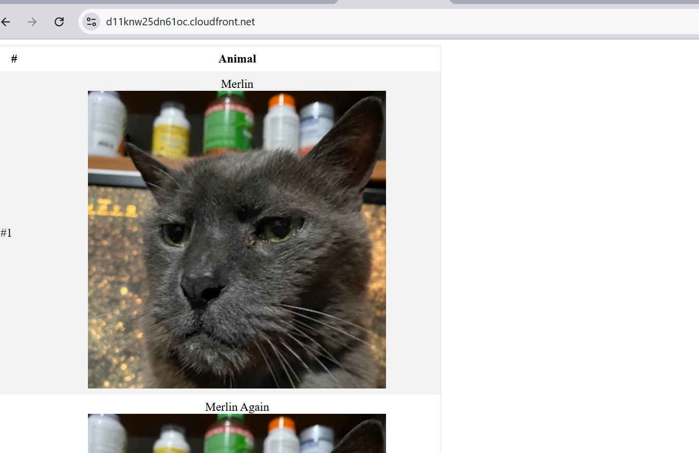
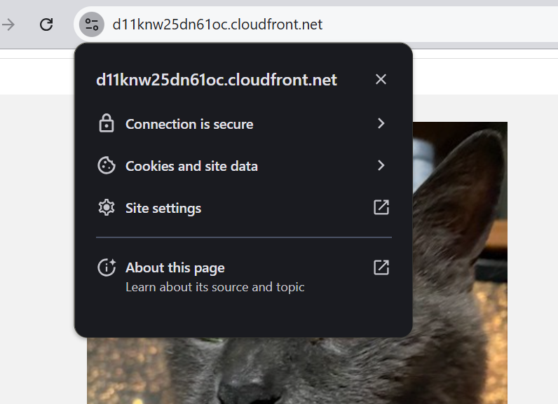
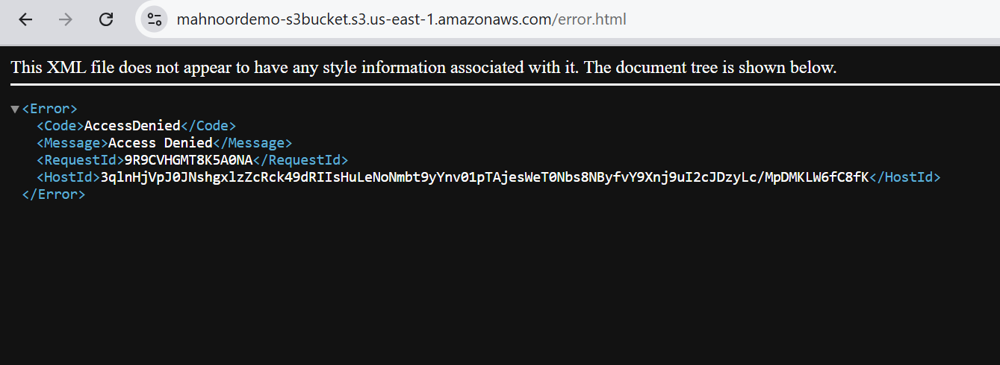

# Static Website Hosting on AWS (S3 + CloudFront)

A static website served from a **private** Amazon S3 bucket through a CloudFront distribution, using Origin Access Control (OAC) so the bucket is never publicly readable.

Built and verified in the AWS console, then torn down. Screenshots and configuration files below document the working deployment.

---

## Architecture



---

## How it works

**Amazon S3** stores the site files. It is storage only — no web server, and Block Public Access stays enabled. The bucket acts as a private *origin*, not a website host.

**CloudFront** is the only entry point. It caches content at edge locations so requests are served from a nearby edge rather than reaching back to the bucket every time, and it terminates TLS using the default `*.cloudfront.net` certificate.

**Origin Access Control (OAC)** connects the two. CloudFront signs its requests to S3 with SigV4, and the bucket policy accepts those signed requests only from this specific distribution.

**Default root object** is set to `index.html` so requests to the distribution root resolve correctly. Because the origin is the S3 REST endpoint rather than the S3 website endpoint, this applies to the root path only — subdirectory paths do not auto-resolve to an index file.

---

## Security design

The bucket policy is the core of this project. It grants `s3:GetObject` to the CloudFront service principal, scoped by a condition on the source ARN:

```json
{
    "Version": "2008-10-17",
    "Id": "PolicyForCloudFrontPrivateContent",
    "Statement": [
        {
            "Sid": "AllowCloudFrontServicePrincipal",
            "Effect": "Allow",
            "Principal": {
                "Service": "cloudfront.amazonaws.com"
            },
            "Action": "s3:GetObject",
            "Resource": "arn:aws:s3:::mahnoordemo-s3bucket/*",
            "Condition": {
                "ArnLike": {
                    "AWS:SourceArn": "arn:aws:cloudfront::473308538971:distribution/E25STIMZLTHXIJ"
                }
            }
        }
    ]
}
```

Two details worth calling out:

- **The `AWS:SourceArn` condition is required.** Without it, the policy trusts the CloudFront service as a whole, meaning any distribution in any AWS account could read the bucket. This is a common misconfiguration.
- **Block Public Access remains fully enabled.** Many tutorials for this project make the bucket world-readable and enable S3 static website hosting instead. That approach works, but it exposes the origin directly and bypasses CloudFront's access controls entirely.

---

## Verification

The direct S3 object URL returns `403 AccessDenied` while the CloudFront URL serves the page over HTTPS. This is the evidence that the origin is genuinely locked down rather than merely fronted by a CDN.

### Bucket policy scoped to the distribution


### CloudFront origin using OAC


### Site served over HTTPS via CloudFront


### Direct S3 access denied


---

## Repository contents

```
.
├── README.md
├── site/
│   ├── index.html
│   └── error.html
│   └── imgs/
├── policies/
│   └── bucket-policy.json
└── screenshots/
```

---

## Notes

The distribution was deleted and the bucket emptied after testing, so there is no live URL. Running cost for a static site at low traffic is minimal, but the resources were removed rather than left idle.

